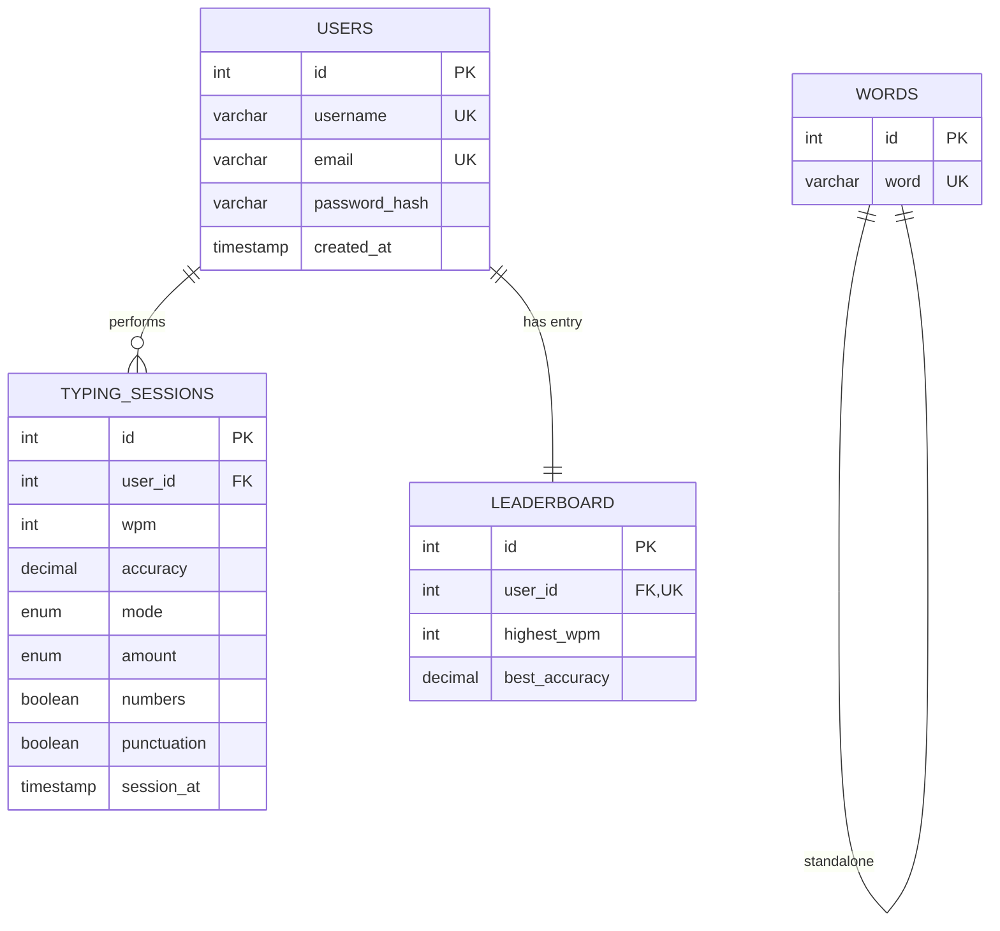
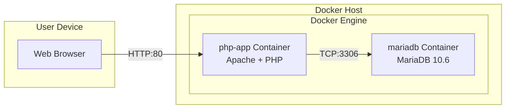

# A-Type: Complete Project Documentation

> A modern, web-based typing speed test application with a **custom-built PHP MVC framework**, real-time performance tracking, and competitive leaderboards.

---

## 📋 Table of Contents

- [Overview](#overview)
- [Key Features](#key-features)
- [Native Backend Framework](#native-backend-framework)
  - [Core Architecture](#core-architecture)
  - [Router (App.php)](#router-appphp)
  - [Base Controller](#base-controller)
  - [Native ORM](#native-orm)
  - [Models Layer](#models-layer)
- [Database Design](#database-design)
- [Frontend Architecture](#frontend-architecture)
- [Security Features](#security-features)
- [Deployment Architecture](#deployment-architecture)
- [API Endpoints](#api-endpoints)

---

## Overview

**A-Type** is a minimalistic, browser-based typing speed test designed to help users improve their typing speed and accuracy. Unlike typical typing applications, A-Type features a **completely custom-built backend framework** written from scratch in PHP, demonstrating deep understanding of web architecture principles without relying on heavy external dependencies.

### What Makes A-Type Unique

| Aspect | Description |
|--------|-------------|
| **Custom MVC Framework** | Built entirely from scratch - no Laravel, Symfony, or any PHP framework |
| **Native ORM** | Hand-crafted Object-Relational Mapper with prepared statements |
| **Zero Dependencies** | Pure PHP backend with no Composer packages |
| **Real-time Metrics** | Instant WPM and accuracy feedback |
| **Containerized** | Docker-ready deployment with isolated services |

---

## Key Features

### 🎯 Core Typing Features

- **Multiple Test Modes**
  - **Time Mode**: Fixed duration tests (15s, 30s, 60s, 120s)
  - **Words Mode**: Fixed word count tests (10, 25, 50, 100 words)
  
- **Customization Options**
  - Toggle punctuation for more challenging tests
  - Toggle numbers for numeric practice
  - Random word generation from 75,000+ word database

- **Real-time Performance Tracking**
  - Live WPM (Words Per Minute) calculation
  - Live accuracy percentage
  - Per-keystroke error detection

### 👤 User Management

- **Authentication System**
  - Secure user registration
  - Email & password login
  - PHP session-based authentication
  - Password hashing with `password_hash()` (bcrypt)

- **User Profiles**
  - Personal statistics dashboard
  - Best scores per mode/amount combination
  - Average WPM and accuracy tracking
  - Total tests completed counter

### 🏆 Leaderboard System

- **Global Rankings**
  - All-time leaderboards
  - Daily leaderboards with time-based filtering
  - Per-mode rankings (time mode vs words mode)
  
- **Performance Optimization**
  - Dedicated leaderboard table for fast queries
  - Indexed foreign keys for rapid lookups

### 🎨 User Interface

- **Minimalistic Design**: Clean, distraction-free interface
- **Responsive Layout**: Works across desktop, tablet, and mobile
- **Instant Reset**: Press "Tab" to restart anytime
- **Modular CSS**: Organized into base, components, pages, and themes

---

## Native Backend Framework

> The entire backend framework is **custom-built from scratch** without using any existing PHP frameworks or packages. This demonstrates mastery of core web architecture principles.

### Core Architecture

```
App/
├── Core/                    # Framework foundation
│   ├── App.php             # Router & Request Handler
│   ├── Controller.php      # Base Controller Class
│   ├── Model.php           # Native ORM Implementation
│   └── dbconnect.php       # Database Configuration
├── Controllers/            # Application Controllers
│   ├── Home.php           # Home & Typing Endpoints
│   ├── Profile.php        # Authentication & Profile
│   ├── Leaderboard.php    # Rankings
│   └── Info.php           # Static Pages
├── Models/                 # Data Models
│   ├── User.php           # User Entity
│   ├── Typing.php         # Typing Sessions
│   └── Word.php           # Word Bank
└── Views/                  # PHP Templates
```

### Router (App.php)

The custom router provides automatic URL-to-controller mapping:

```php
class App
{
    protected $controller = 'App\\Controllers\\Home';
    protected $method = 'index';
    protected $params = [];

    public function __construct()
    {
        session_start();
        $url = $this->parseUrl();
        
        // Dynamic controller resolution
        if (isset($url[0])) {
            $controller_name = '\\App\\Controllers\\' . ucfirst($url[0]);
            if (class_exists($controller_name)) {
                $this->controller = $controller_name;
                unset($url[0]);
            }
        }
        
        // Dynamic method resolution
        if (isset($url[1]) && method_exists($this->controller, $url[1])) {
            $this->method = $url[1];
            unset($url[1]);
        }
        
        // Parameter extraction
        $this->params = $url ? array_values($url) : [];
        
        // Execute controller action
        call_user_func_array([$this->controller, $this->method], $this->params);
    }

    public function parseUrl()
    {
        if (isset($_GET['url'])) {
            return explode('/', filter_var(rtrim($_GET['url'], '/'), FILTER_SANITIZE_URL));
        }
        return ['Home', 'index'];
    }
}
```

**Key Native Features:**
- ✅ Automatic URL parsing with `FILTER_SANITIZE_URL` for security
- ✅ Dynamic controller/method resolution via PHP Reflection
- ✅ Automatic parameter extraction from URL segments
- ✅ Session initialization at bootstrap
- ✅ Fallback to default controller/method

### Base Controller

The abstract controller provides helper methods for all controllers:

```php
class Controller
{
    public function model($model)
    {
        $model = ('\\App\\Models\\') . $model;
        return new $model();
    }

    public function view($view, $data = [])
    {
        require_once '../App/Views/' . $view . '.php';
    }
}
```

**Design Pattern**: Factory Method pattern for model instantiation, enabling loose coupling between controllers and models.

### Native ORM

The custom ORM provides a full-featured database abstraction layer:

```php
class Model
{
    protected $table;
    protected $fillable = [];
    private $dbh;

    public function __construct()
    {
        $this->dbh = new \PDO(
            DB . ':host=' . DB_URL . ';dbname=' . DB_NAME, 
            DB_USER, 
            DB_PASS, 
            [\PDO::ATTR_PERSISTENT => true]
        );
        $this->dbh->setAttribute(\PDO::ATTR_ERRMODE, \PDO::ERRMODE_EXCEPTION);
    }
}
```

#### Native ORM Methods

| Method | Description | SQL Injection Protected |
|--------|-------------|------------------------|
| `insert($data)` | Creates new record with fillable filtering | ✅ Prepared statements |
| `update($id, $data)` | Updates record by ID | ✅ Prepared statements |
| `delete($id)` | Removes record by ID | ✅ Prepared statements |
| `get($id)` | Fetches single record | ✅ Prepared statements |
| `getAll($limit)` | Fetches multiple records | ✅ Prepared statements |
| `query($sql, $params)` | Custom query execution | ✅ Prepared statements |

#### Mass Assignment Protection

```php
public function insert($data)
{
    // Only allow fields defined in $fillable
    $fields = array_intersect(array_keys($data), $this->fillable);
    
    $placeholders = array_map(fn($field) => ':' . $field, $fields);
    
    $sql = "INSERT INTO {$this->table} (" . implode(',', $fields) . ") 
            VALUES (" . implode(',', $placeholders) . ")";
    
    $stmt = $this->dbh->prepare($sql);
    
    foreach ($fields as $field) {
        $stmt->bindValue(':' . $field, $data[$field]);
    }
    
    return $stmt->execute() ? $this->dbh->lastInsertId() : false;
}
```

**Security Features:**
- ✅ `$fillable` array prevents mass assignment vulnerabilities
- ✅ All queries use PDO prepared statements
- ✅ Automatic type detection for parameter binding
- ✅ Persistent connections for performance

### Models Layer

#### User Model
```php
class User extends Model
{
    protected $table = 'users';
    protected $fillable = ['username', 'email', 'password_hash'];

    public function verify($email, $password)
    {
        $sql = 'SELECT * FROM users WHERE email = :email';
        $data = $this->query($sql, ['email' => $email]);
        
        if ($data && password_verify($password, $data[0]['password_hash'])) {
            return $data[0];
        }
        return false;
    }
}
```

#### Typing Model
```php
class Typing extends Model
{
    protected $table = 'typing_sessions';
    protected $fillable = ['user_id', 'wpm', 'accuracy', 'punctuation', 'numbers', 'mode', 'amount'];

    // Statistical aggregation
    public function avg($user_id) { /* Returns averages and totals */ }
    
    // Best scores with self-join optimization
    public function getBestScores($user_id) { /* Complex subquery for personal bests */ }
    
    // Leaderboard with time filtering
    public function leaderboard($filter = 'all_time') { /* Daily/All-time rankings */ }
}
```

#### Word Model
```php
class Word extends Model
{
    protected $table = 'words';

    public function words($amount)
    {
        $sql = 'SELECT word FROM words ORDER BY RAND() LIMIT :amount';
        return $this->query($sql, ['amount' => $amount]);
    }
}
```

---

## Database Design

### Schema Overview (3NF Compliant)



### Table Details

| Table | Purpose | Records |
|-------|---------|---------|
| `users` | User accounts with secure password storage | User data |
| `typing_sessions` | Complete test history with all parameters | All test results |
| `leaderboard` | Cached best scores for fast rankings | One per user |
| `words` | Word bank for test generation | 75,000+ words |

### Performance Optimizations

- **Indexed Foreign Keys**: `idx_ts_user_id`, `idx_lb_user_id`
- **Unique Constraints**: Prevent duplicate usernames/emails
- **Cascade Deletes**: Automatic cleanup on user removal
- **Denormalized Leaderboard**: Fast rankings without scanning all sessions

---

## Frontend Architecture

### JavaScript Modules

```
Public/js/
├── scripts.js              # Entry point
└── modules/
    ├── game.js             # Core typing game logic (11.6KB)
    ├── events.js           # Event handlers & keyboard input (11.7KB)
    ├── ui.js               # UI updates & DOM manipulation (8.7KB)
    ├── stats.js            # WPM/Accuracy calculations (4.5KB)
    ├── theme.js            # Theme switching (3.8KB)
    └── utils.js            # Helper utilities
```

### CSS Architecture

```
Public/css/
├── styles.css              # Main entry (imports)
├── base/                   # Foundation styles
│   ├── reset.css          # CSS reset
│   ├── variables.css      # CSS custom properties
│   └── typography.css     # Font definitions
├── components/             # Reusable components
│   ├── buttons.css
│   ├── inputs.css
│   ├── modals.css
│   └── cards.css
├── pages/                  # Page-specific styles
│   ├── home.css
│   ├── profile.css
│   ├── leaderboard.css
│   └── info.css
└── themes/                 # Theme variants
    └── dark.css
```

---

## Security Features

| Feature | Implementation |
|---------|----------------|
| **Password Hashing** | `password_hash()` with `PASSWORD_DEFAULT` (bcrypt) |
| **SQL Injection Prevention** | PDO prepared statements throughout |
| **Mass Assignment Protection** | `$fillable` whitelist in all models |
| **URL Sanitization** | `FILTER_SANITIZE_URL` in router |
| **Session Security** | Server-side PHP sessions |
| **XSS Prevention** | Input validation and output encoding |
| **CSRF Protection** | Session-based verification |

---

## Deployment Architecture

### Docker Configuration

```yaml
services:
  php-app:
    build: .
    ports: ["80:80"]
    depends_on: [mariadb]
    environment:
      DB_HOST: mariadb
      DB_USER: root
      DB_PASSWORD: rootpass
      DB_NAME: atype
    volumes:
      - ./App:/var/www/html/App
      - ./Public:/var/www/html/Public

  mariadb:
    image: mariadb:10.6
    ports: ["3306:3306"]
    volumes:
      - mariadb_data:/var/lib/mysql
      - ./db/atype.sql:/docker-entrypoint-initdb.d/init.sql
      - ./db/words.txt:/docker-entrypoint-initdb.d/words.txt
```

### Deployment Diagram



---

## API Endpoints

### JSON API

| Endpoint | Method | Description | Auth Required |
|----------|--------|-------------|---------------|
| `/home/typing` | POST | Submit typing test results | ✅ |
| `/home/words?amount=N` | GET | Get random words for test | ❌ |

### Page Routes

| Route | Controller | Method | Description |
|-------|------------|--------|-------------|
| `/` | Home | index | Main typing test page |
| `/profile` | Profile | index | User dashboard (requires login) |
| `/profile/login` | Profile | login | Login handler |
| `/profile/register` | Profile | register | Registration handler |
| `/profile/logout` | Profile | logout | Session termination |
| `/leaderboard` | Leaderboard | index | Global rankings |
| `/info` | Info | index | About page |

---

## Quick Start

```bash
# Clone the repository
git clone https://github.com/developers-together/A-type.git
cd A-type

# Start with Docker
docker-compose up -d

# Access the application
open http://localhost
```

---

## Technology Stack

| Layer | Technology |
|-------|------------|
| **Backend** | PHP 8.x (Custom MVC Framework) |
| **Database** | MariaDB 10.6 |
| **Frontend** | Vanilla JavaScript (ES6+) |
| **Styling** | CSS3 (Custom Design System) |
| **Deployment** | Docker & Docker Compose |
| **Web Server** | Apache with mod_rewrite |

---

<div align="center">

**Built with ❤️ by [Developers Together](https://github.com/developers-together)**

*No frameworks. No dependencies. Just pure PHP and JS.*

</div>
