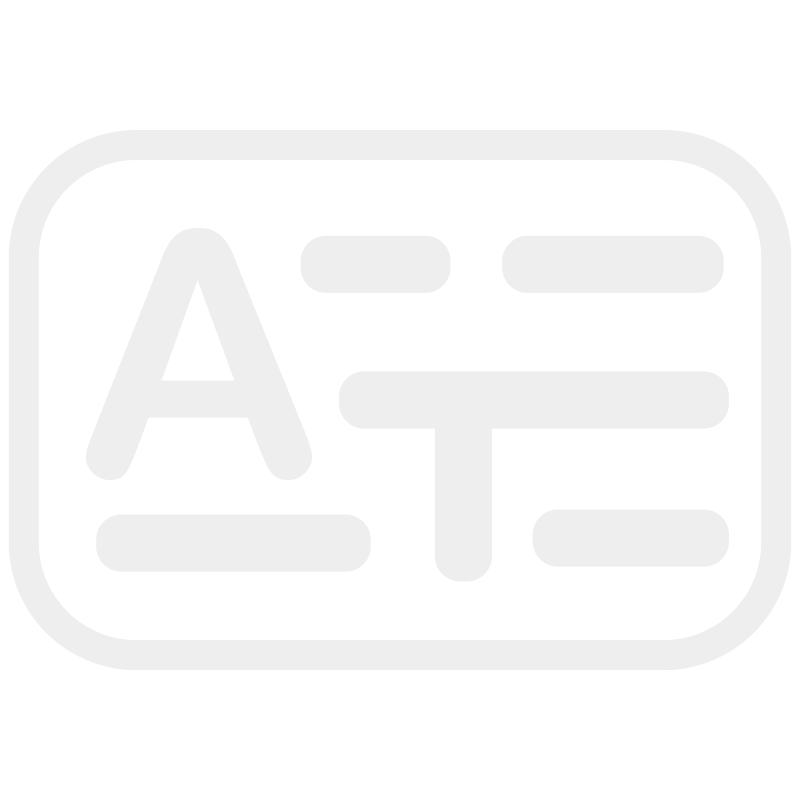
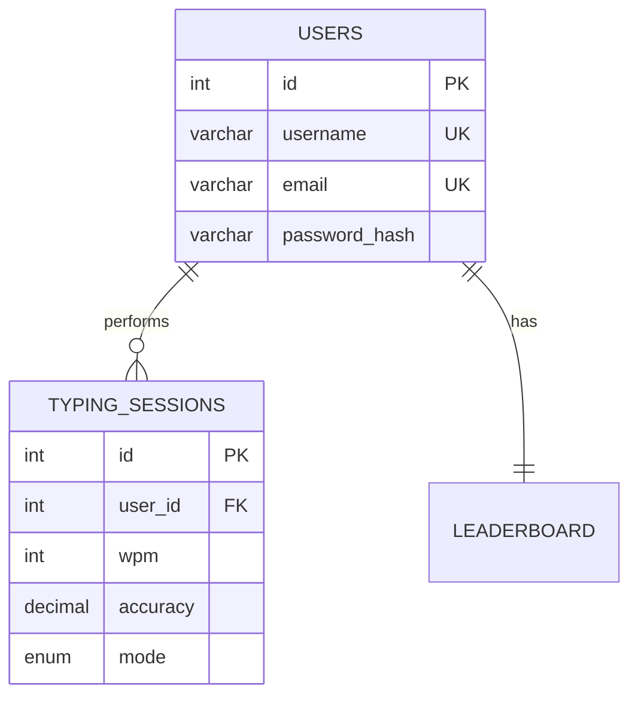

<div align="center">

# ⌨️ A-Type

[](https://php.net)
[](https://mariadb.org)
[](https://docker.com)
[](LICENSE)

[](https://developer.mozilla.org/en-US/docs/Web/JavaScript)
[](https://www.w3.org/Style/CSS/)
[](https://html.spec.whatwg.org/)

**A minimalistic, browser-based typing speed test with a custom-built PHP MVC framework**

[Live Demo](https://developers-together.github.io/A-type/) • [Features](#-features) • [Documentation](#-documentation) • [Quick Start](#-quick-start)



</div>

---

## 🎯 Features

<table>
<tr>
<td width="50%">

### ⚡ Typing Tests
- **Time Mode** — 15s, 30s, 60s, 120s
- **Words Mode** — 10, 25, 50, 100 words
- Toggle **punctuation** & **numbers**
- Press **Tab** to instant reset

</td>
<td width="50%">

### 📊 Performance Tracking
- **Real-time WPM** calculation
- **Live accuracy** percentage
- Personal best scores
- Historical statistics

</td>
</tr>
<tr>
<td width="50%">

### 🏆 Leaderboards
- Global rankings
- Daily & all-time filters
- Per-mode competitions

</td>
<td width="50%">

### 👤 User Profiles
- Secure authentication
- Personal dashboard
- Progress tracking
- Average stats

</td>
</tr>
</table>

---

## 🏗️ Custom Native Framework

> [!IMPORTANT]
> A-Type uses a **completely custom-built PHP MVC framework** — no Laravel, Symfony, or external dependencies.

### Architecture Overview

```
App/
├── Core/               # Framework Foundation
│   ├── App.php        # Custom Router
│   ├── Controller.php # Base Controller
│   └── Model.php      # Native ORM
├── Controllers/        # Request Handlers
├── Models/             # Data Layer
└── Views/              # Templates
```

### 🔧 Framework Highlights

| Component | Description |
|-----------|-------------|
| **Router** | Automatic URL-to-controller mapping with sanitization |
| **ORM** | Full CRUD with PDO prepared statements |
| **Security** | Mass assignment protection, bcrypt hashing |
| **Sessions** | PHP native session management |

<details>
<summary><strong>📖 View ORM Example</strong></summary>

```php
class Model
{
    protected $table;
    protected $fillable = [];

    public function insert($data)
    {
        // Mass assignment protection
        $fields = array_intersect(array_keys($data), $this->fillable);
        
        // Prepared statement generation
        $sql = "INSERT INTO {$this->table} ...";
        $stmt = $this->dbh->prepare($sql);
        
        return $stmt->execute() ? $this->dbh->lastInsertId() : false;
    }
}
```

</details>

---

## 🚀 Quick Start

### Docker (Recommended)

```bash
# Clone the repository
git clone https://github.com/developers-together/A-type.git
cd A-type

# Start containers
docker-compose up -d

# Open in browser
open http://localhost
```

### Manual Setup

```bash
# Requirements: PHP 8.x, MariaDB/MySQL

# 1. Import database
mysql -u root -p < db/atype.sql

# 2. Configure environment
export DB_HOST=localhost
export DB_USER=root
export DB_PASSWORD=yourpassword
export DB_NAME=atype

# 3. Start PHP server
php -S localhost:8000 -t Public
```

---

## 📁 Project Structure

```
A-type/
├── App/                    # Backend (Custom MVC Framework)
│   ├── Core/              # Framework core classes
│   ├── Controllers/       # HTTP request handlers
│   ├── Models/            # Database models
│   └── Views/             # PHP templates
├── Public/                 # Frontend (Entry Point)
│   ├── css/               # Stylesheets
│   ├── js/                # JavaScript modules
│   ├── assets/            # Images & fonts
│   └── index.php          # Application entry
├── db/                     # Database
│   ├── atype.sql          # Schema definition
│   └── words.txt          # 75,000+ word bank
├── docker-compose.yaml     # Container orchestration
└── Dockerfile             # PHP container
```

---

## 📚 Documentation

| Document | Description |
|----------|-------------|
| [**FEATURES.md**](Public/FEATURES.md) | Complete feature documentation with architecture diagrams |

### Database Schema



---

## 🛡️ Security

| Feature | Implementation |
|---------|----------------|
| Password Storage | `bcrypt` via `password_hash()` |
| SQL Injection | PDO prepared statements |
| Mass Assignment | `$fillable` whitelist |
| XSS Prevention | Input sanitization |

---

## 🤝 Contributing

Contributions are welcome! Please feel free to submit a Pull Request.

```bash
# Fork the repository
# Create your feature branch
git checkout -b feature/amazing-feature

# Commit your changes
git commit -m 'Add amazing feature'

# Push to the branch
git push origin feature/amazing-feature

# Open a Pull Request
```

### Ideas for Contributions

- 🎨 New themes (dark mode, custom colors)
- 🌍 Multi-language support
- 📱 Mobile optimization
- 🎮 Multiplayer mode
- 📈 Advanced analytics

---

## 📄 License

This project is licensed under the MIT License.

---

<div align="center">

**Built with ❤️ by [Developers Together](https://github.com/developers-together)**

*No frameworks. No dependencies. Pure PHP and JS.*

[](https://github.com/developers-together/A-type)

</div>
