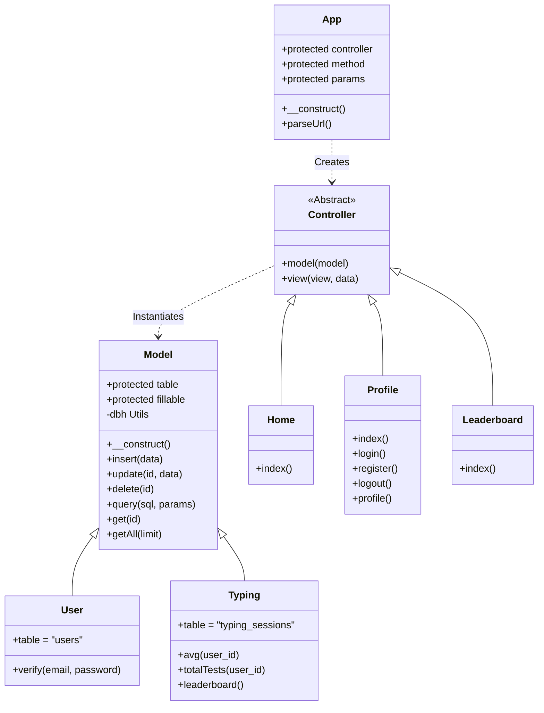
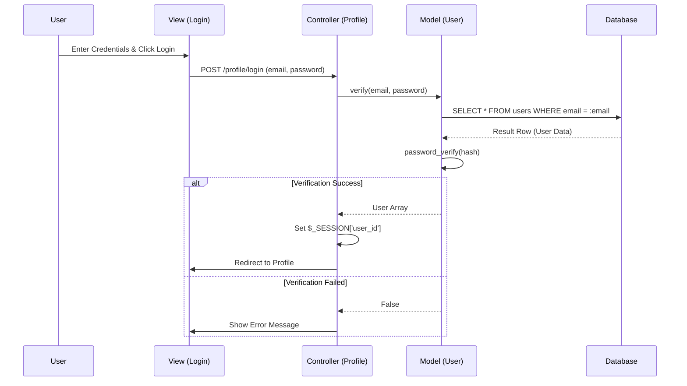
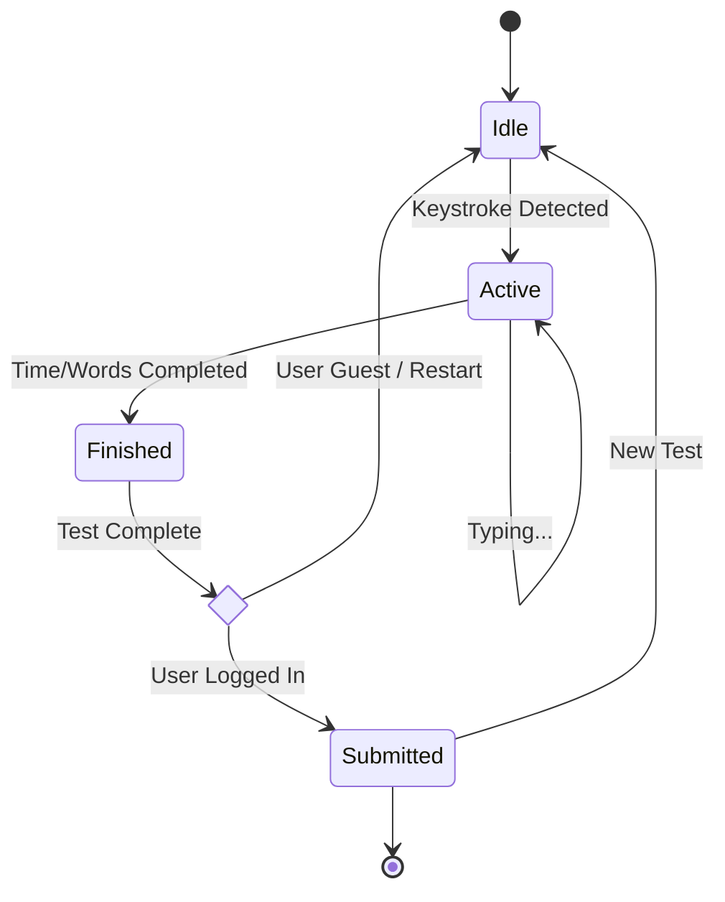
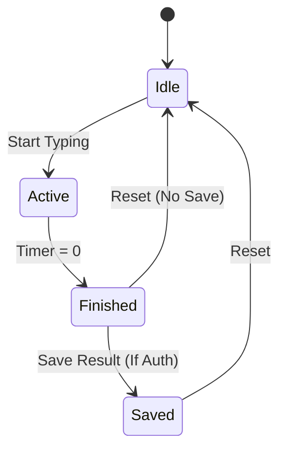
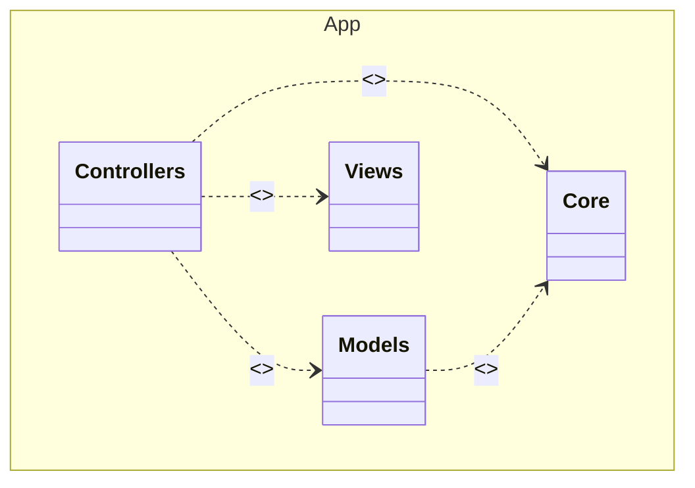
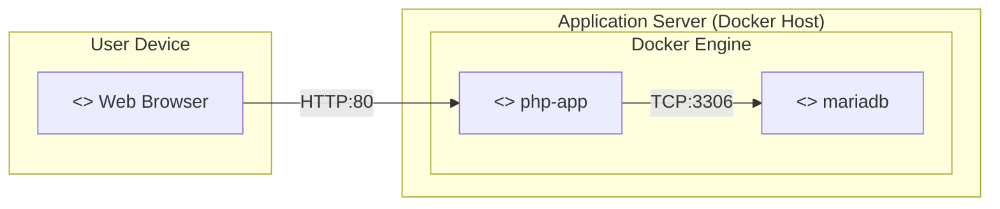
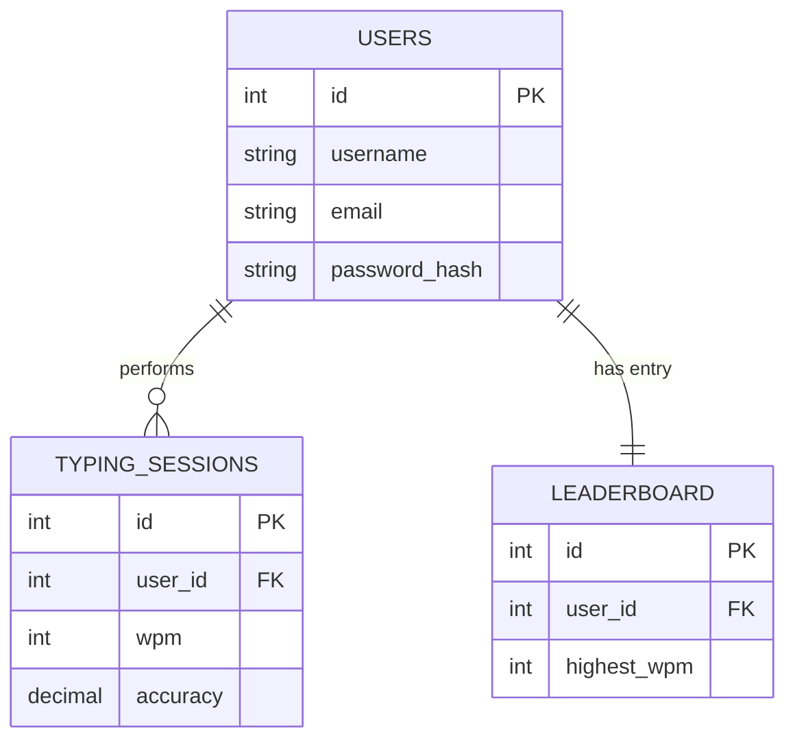

# Final Report & Documentation: Atype

## 1. Introduction

**Atype** is a modern, web-based typing speed test application designed to help users improve their typing efficiency through a sleek and responsive interface. The purpose of this project is to provide a competitive yet minimalist environment where users can track their progress, analyze their typing habits, and compete on global leaderboards.

**Innovative Aspects:**
- **Custom MVC Framework**: built from scratch to demonstrate a deep understanding of core web architecture principles without relying on heavy external dependencies.
- **Real-time Performance Metrics**: users receive instant feedback on their WPM (Words Per Minute) and accuracy, stored and analyzed over time.
- **Optimized Data Structure**: a hybrid database design that balances normalization for data integrity with denormalized structures for high-performance leaderboard rendering.

---

## 2. Modeling Section

### 2.1 Class Diagram



**Documentation & Design Choices:**
We maintained a strict inheritance hierarchy. The `App` class serves as the router, instantiating the appropriate `Controller`. All specific controllers (`Home`, `Profile`) inherit from the base `Controller` class to access the shared `view()` and `model()` methods. Similarly, all data entities inherit from the base `Model` class, which encapsulates low-level PDO database operations (`query`, `insert`, `get`), adhering to the **DRY (Don't Repeat Yourself)** principle.

### 2.2 Use Case Diagram

```mermaid
usecaseDiagram
    actor "Guest" as g
    actor "Registered User" as u
    
    package "Atype Application" {
        usecase "Take Typing Test" as UC1
        usecase "View Leaderboard" as UC2
        usecase "Login / Register" as UC3
        usecase "Save Session Result" as UC4
        usecase "View Profile Stats" as UC5
        usecase "Logout" as UC6
        usecase "Update Personal Best" as UC7
    }

    u --|> g : inherits

    g --> UC1
    g --> UC2
    g --> UC3

    u --> UC4
    u --> UC5
    u --> UC6

    UC4 ..> UC7 : <<include>>
```

**Documentation & Design Choices:**
We separated actors into `Guest` and `Registered User`. Since a Registered User can perform all Guest actions (like taking a test), we used an **Inheritance** relationship. We also used an `<<include>>` relationship between "Save Session" and "Update Personal Best" to show that the system automatically handles leaderboard logic whenever a result is submitted.

### 2.3 Sequence Diagram (User Login)



**Documentation & Design Choices:**
This diagram details the `Login` flow. We explicitly show the interaction between the Controller and Model (`verify()`) to demonstrate how business logic is decoupled from the HTTP request handling. The Model handles the raw database query and hash verification, returning only the result to the Controller.

### 2.4 Activity Diagram (Typing Session)



**Documentation & Design Choices:**
The Activity flow (represented here as a high-level state flow) shows the lifecycle of a typing test. The critical decision point `check_login` ensures that we only attempt to save data (`Submitted` state) if the user is authenticated, preventing database errors.

### 2.5 State Machine Diagram (Session Lifecycle)



**Documentation & Design Choices:**
This diagram focuses on the states of the *Application Interface* during a test. It clearly differentiates between `Finished` (User can see results) and `Saved` (Data persisted), helping to clarify the UI feedback loop (e.g., showing a "Saved" toast notification).

### 2.6 Package Diagram



**Documentation & Design Choices:**
The package structure reflects our distinct formatting. `Core` is the foundation. `Controllers` depend on `Models` for data and `Views` for presentation, but `Models` and `Views` never communicate directly, strictly adhering to MVC principles.

### 2.7 Deployment Diagram



**Documentation & Design Choices:**
We chose a **Microservices-style** deployment using Docker containers. The `php-app` container runs the application logic and is the only component exposed to the User (via Port 80). The `mariadb` container is isolated in an internal network, accessible only by the App container, which enhances security by preventing direct external database access.

### 2.8 Entity-Relationship Diagram (ERD)



**Documentation & Design Choices:**
- **Users to Typing Sessions (1:N)**: A one-to-many relationship was chosen because a single user can perform an unlimited number of typing tests. This allows for historical tracking of performance.
- **Users to Leaderboard (1:1)**: We enforced a one-to-one relationship here. Instead of calculating the leaderboard on the fly by scanning millions of session rows (which is slow), we maintain a dedicated `leaderboard` table that updates only when a user achieves a new personal best. This is a performance optimization.

---

## 3. Architectural Justification

### Architecture Chosen: **MVC (Model-View-Controller)**

We specifically chose a **Custom 3-Tier Layered Architecture** following the **MVC** pattern.

**Detailed Justification:**
1.  **Separation of Concerns**: By separating the application into three distinct layers, we ensure that business logic (`Models`), user interface (`Views`), and request handling (`Controllers`) do not mix. This allows frontend developers to work on `views/` without breaking backend logic in `controllers/`.
2.  **Scalability**: The modular nature of MVC allows us to easily add new features. For example, adding a "Multiplayer" mode would require a new `MultiplayerController` and `MultiplayerModel` without needing to refactor the existing `Home` or `Profile` code.
3.  **Maintainability**: The `App` core router acts as a single entry point. This centralization makes debugging routing issues significantly easier compared to a flat-file structure.
4.  **Security**: Input is intercepted and processed in the Controller before ever reaching the Model or Database. This provides a natural checkpoint for sanitization and validation, helping to prevent SQL Injection and XSS attacks.

---

## 4. Database Design & 3NF Justification

The database schema, defined in `db/atype.sql`, has been designed to strictly follow the **Third Normal Form (3NF)** to ensure data integrity and reduce redundancy.

### Compliance with 3NF:

1.  **First Normal Form (1NF)**:
    -   All columns contain atomic values (e.g., `mode` contains 'time' or 'words', not a list of settings).
    -   All tables have a Primary Key (`id`).

2.  **Second Normal Form (2NF)**:
    -   There are no partial dependencies. In `typing_sessions`, attributes like `wpm`, `accuracy`, and `session_at` fully depend on the primary key `id`, not just part of it. The `user_id` is a foreign key linking to the full User entity.

3.  **Third Normal Form (3NF)**:
    -   **No Transitive Dependencies**: All non-key attributes are dependent *only* on the primary key.
    -   *Example - Users Table*: `email` depends on `user_id`. It does not depend on `username`.
    -   *Example - Typing Sessions*: `wpm` depends on the specific session `id`.
    -   *Leaderboard Exception*: The `leaderboard` table technically contains derived data (`highest_wpm`). While a strict academic view might flag this, in practical database design, this is a distinct entity representing the "User's Best Stats". Within the table itself, `highest_wpm` relies on the `id` of that leaderboard entry. We handle the data consistency via application logic (updating it only when a session is completed), ensuring the benefits of 3NF (integrity) are balanced with the needs of a real-time web application (speed).
